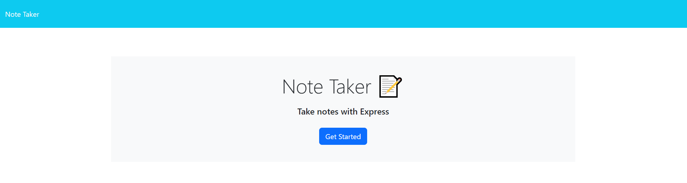
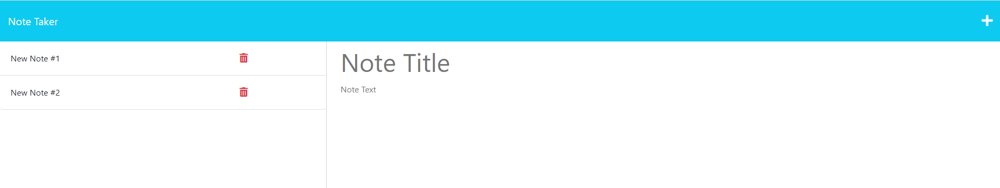

# Note Taker Starter Code

## Description

The following challenge involved completing the backend for a note-taker application. The application runs on express.js and has the following features:
-	Enter notes with a title & text
-	Save notes and add them to your list
-	View and access notes from a saved list
-	Delete notes from your saved list

When opening the application, a landing page is presented with a link to the note-taker. On the note-taker page, all saved notes are rendered in the left column while new notes can be entered in the right column. 

Live Application: https://desolate-scrubland-91857.herokuapp.com/notes

## Installation

Please install libraries and run on express.js. The application will be invoked by using the following command:

node server.js

## License

none
